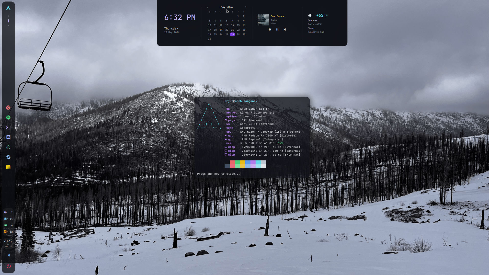
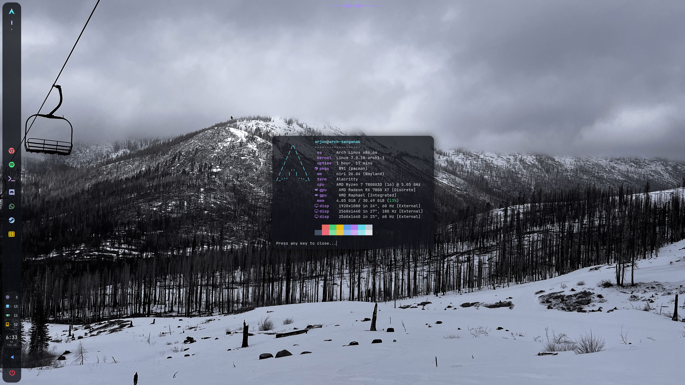
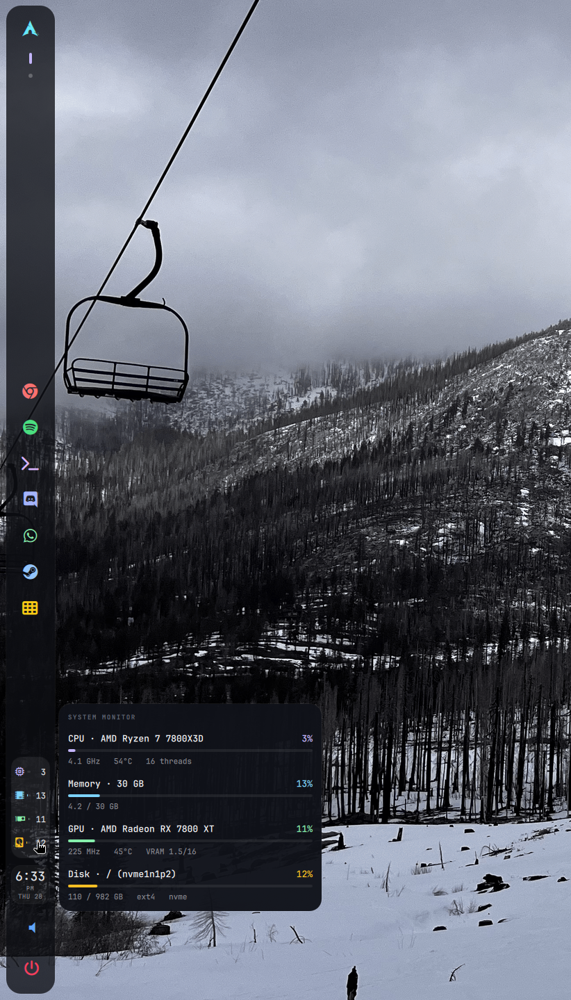

# driftos

A complete, opinionated Arch Linux rice for the [Niri](https://github.com/YaLTeR/niri)
scrollable-tiling Wayland compositor. Dark-mode only, translucent surfaces,
animated everything. Built around [Quickshell](https://quickshell.outfoxxed.me/)
for the bars, launcher, and power flyout.



---

## What you get

- **Niri** compositor with custom keybinds and slightly springy window/workspace animations
- **Quickshell**-driven UI: hover-reveal top bar dashboard, vertical 72px side bar,
  Launchpad-style launcher, translucent power flyout
- **gtklock** lock screen with a pre-blurred copy of the live wallpaper
- **mako** notifications, **cava**-driven waveform in the top bar when music plays
- **kanshi** display profiles (vm / personal / laptop) auto-applied by `systemd --user`
- **ly** TUI greeter on tty1 — no GUI display-manager dependency
- **Limine + sbctl Secure Boot** option with an atomic re-sign pacman hook,
  or plain **GRUB** for VMs / simplicity
- One-shot installer that works either from the Arch ISO (bare-metal install)
  or from an already-booted user session (rice-only mode)

| Default desktop | System monitor popover |
| --- | --- |
|  |  |

---

## Stack

| Layer | Choice |
| --- | --- |
| Compositor | Niri (scrollable-tiling Wayland) |
| Shell / bars / launcher / power flyout | Quickshell (QML) |
| Lock screen | gtklock — manual only, no idle daemon |
| Notifications | mako |
| Wallpaper | swaybg (or swww when installed) — animated cycle via `wallpaper-next` |
| Audio | PipeWire + WirePlumber |
| Network | NetworkManager |
| Bluetooth | BlueZ |
| Terminal | alacritty |
| Login manager | ly |
| File manager | nautilus |
| Display profiles | kanshi + nwg-displays |
| Fonts | Inter + JetBrainsMono Nerd Font |
| Icons | Papirus-Dark |

No Hyprland, no waybar, no eww/ags/wofi/rofi/fuzzel. The rice is intentionally
minimal — every package earns its place.

---

## Quick start

### From the Arch ISO (bare-metal install)

Boot the official Arch ISO in **UEFI mode**. At the live prompt (as `root`):

```bash
# (Wi-Fi only) bring up the network first
iwctl

pacman -Sy --noconfirm git
git clone https://github.com/tech-support03/driftos.git ~/arch-setup
cd ~/arch-setup

# interactive — prompts for disk, user, passwords
./install.sh

# or fully unattended with Secure Boot
./install.sh --disk /dev/nvme0n1 --user arjun --hostname driftos \
             --timezone America/New_York --profile personal --secure-boot --yes
```

### From an already-installed system (rice only)

```bash
git clone https://github.com/tech-support03/driftos.git ~/arch-setup
cd ~/arch-setup
./install.sh --profile personal   # same script — detects it's NOT on the ISO
```

`install.sh` auto-detects the environment: ISO → bootstrap pipeline,
booted system → rice modules.

### Profile picker

The `--profile` flag is the single most important choice. Pick once,
and it cascades through the display layout, package selection, and
which systemd services get enabled.

| Profile    | Use when                                  | What it sets up                                                                |
| ---------- | ----------------------------------------- | ------------------------------------------------------------------------------ |
| `vm`       | KVM/QEMU, VirtualBox, headless test rigs  | Single 1920×1080 wildcard; guest agents auto-detected (no microcode).          |
| `personal` | Desktop tower with multi-monitor setup    | 3-monitor topology + CPU microcode.                                            |
| `laptop`   | Any laptop, single internal panel + dock  | Auto-fits the laptop's panel; TLP + acpid + bluetooth + lid-switch=suspend.    |

**Laptop install example** — just the internal display, full power management:

```bash
./install.sh --disk /dev/nvme0n1 --user you --hostname driftos-laptop \
             --profile laptop --target ssd --secure-boot --yes
```

See [docs/install-flags.md](docs/install-flags.md) for the complete flag
reference, environment-variable equivalents, and recipes for each profile.

---

## Keybinds

| Bind | Action |
| --- | --- |
| `Super+Return` | alacritty |
| `Super+Space` | toggle Quickshell launcher |
| `Super+Escape` | toggle power flyout (Lock / Sign out / Suspend / Reboot / Power off) |
| `Super+L` | lock (gtklock) |
| `Super+W` | close window |
| `Super+F` | maximize column |
| `Super+Shift+F` | fullscreen window |
| `Super+R` | reset window height |
| `Super+Shift+B` | next wallpaper |
| `Super+1..9` | switch workspace |
| `Super+Shift+1..3` | move window to workspace |
| `Super+Arrow` | focus column / window |
| `Super+Shift+Arrow` | move column / window |
| `Print` | screenshot (niri built-in picker) |
| `XF86Audio*` | playerctl / wpctl |
| `XF86MonBrightness*` | brightnessctl |

The system **never auto-locks and never auto-blanks** — lock and suspend
are user-initiated only.

---

## Customization

### Pinned-app dock

The dock lives in `dotfiles/quickshell/bars/SideBar.qml` — look for the
`Column { id: dock ... }` block. Each pinned app is a one-line
`IconButton { glyph: ...; tint: ...; onActivated: root.launch("...") }`.
Reorder, add, or remove lines and save — Quickshell auto-reloads.

### Wallpaper

Drop images into `~/Pictures/Wallpapers/`. Cycle with `Super+Shift+B`
(or run `wallpaper-next` directly). The current pick is pre-blurred into
`~/.cache/lockscreen-bg.jpg` so gtklock always tracks the desktop.

### Display layout

Run `nwg-displays` for a drag-and-drop arranger; it writes
`~/.config/niri/monitor.kdl`, which `config.kdl` includes. kanshi
auto-applies the right profile when monitors come and go.

### Colors / animations

Tokens live in `dotfiles/quickshell/Theme.qml` (accent, surface alphas,
radii, animation durations). Niri's accent reads from the same source.

---

## Layout

```
~/arch-setup/
├── install.sh                     entry point — routes to bootstrap or rice
├── bootstrap.sh                   ISO-side bare-metal installer
│
├── iso-stage/                     bare-metal install pipeline (runs from ISO)
│   ├── 01-preflight.sh            UEFI / network / keyring / Setup-Mode checks
│   ├── 02-disk.sh                 GPT partition + format + mount /mnt
│   ├── 03-pacstrap.sh             base + kernel + bootloader pkgs
│   ├── 04-chroot-config.sh        inside chroot: locale, user, NM, mkinitcpio
│   └── 05-bootloader-chroot.sh    inside chroot: dispatch to grub/limine
│
├── modules/                       rice-side modules (runs from user session)
│   ├── 00-display-config.sh       profile-aware kanshi
│   ├── 01-base-packages.sh        pacman repo packages
│   ├── 02-yay-bootstrap.sh        AUR helper
│   ├── 03-aur-packages.sh         niri, nwg-displays, kanshi, xwayland-satellite, spotify
│   ├── 04-niri-stack.sh           xdg-portal + niri session entry
│   ├── 05-bootloader-grub.sh      reused by bootstrap (chroot-safe)
│   ├── 06-bootloader-limine.sh    reused by bootstrap (chroot-safe)
│   ├── 07-services.sh             NetworkManager, bluetooth, seatd, ly, pipewire
│   ├── 08-link-dotfiles.sh        symlink dotfiles into ~/.config
│   └── 09-wallpapers.sh           five sample wallpapers (rendered by swaybg/swww)
│
├── dotfiles/                      mirrors target ~/.config/* layout
├── scripts/                       → ~/.local/bin/<name> on install
└── docs/screenshots/              README assets
```

---

## Installer flags

The full reference — every flag, every environment-variable equivalent,
recipes for each profile — lives in
**[docs/install-flags.md](docs/install-flags.md)**. The summary below covers
the disk layout and target-type table since those are install-time decisions
you can't change later without reinstalling.

### Disk layout

Written by `iso-stage/02-disk.sh`:

| Partition | Size  | Type   | FS    | Mount  |
| --------- | ----- | ------ | ----- | ------ |
| p1 (UEFI) | 1 GiB | EF00   | FAT32 | /boot  |
| p2        | rest  | 8300   | ext4  | /      |
| p1 (BIOS) | 1 MiB | EF02   | —     | —      |

Kernel + initramfs live on the ESP (mounted at `/boot`) because Limine reads
them via `boot():/`.

### Target type (`--target`)

| Target | ESP size | Root mount opts                | GRUB install style                                                                            |
| ------ | -------- | ------------------------------ | --------------------------------------------------------------------------------------------- |
| `ssd`  | 1 GiB    | `noatime,discard=async`        | NVRAM entry "GRUB"; `fstrim.timer` enabled.                                                   |
| `usb`  | 512 MiB  | `noatime,nodiratime,commit=120`| `--removable` (portable to any UEFI machine via `\EFI\BOOT\BOOTX64.EFI`).                     |
| `auto` | —        | (picks based on disk introspection) | Reads `/sys/block/.../removable` and `lsblk TRAN`; picks `ssd` or `usb` automatically.   |

### USB testing on a laptop (recommended before bare-metal install)

1. Plug in a fast USB 3.x stick or USB-NVMe enclosure (≥ 16 GiB).
2. Boot the Arch ISO in UEFI mode (laptop firmware boot menu → ISO USB).
3. `pacman -Sy --noconfirm git && git clone https://github.com/tech-support03/driftos.git ~/arch-setup`
4. `cd ~/arch-setup && ./install.sh --disk /dev/sdX --user you --profile laptop --target usb`
   — **double-check** the disk path; on most laptops the internal SSD is
   `/dev/nvme0n1` and the USB is `/dev/sda` or similar. Verify with
   `lsblk -dpno NAME,SIZE,MODEL,TRAN,REM`.
5. After install completes, reboot into the firmware boot menu and pick the
   USB drive. The `--removable` GRUB install means it works on any UEFI
   machine without touching laptop NVRAM.

If the USB-installed system works on your hardware, redo step 4 against the
internal SSD with `--target ssd --secure-boot`. Don't enable Secure Boot on
the USB run — `sbctl` enrolls keys into the laptop's firmware NVRAM, which
defeats the whole point of using a USB. The installer refuses this combo by
default; use `--force-usb-secure-boot` only if you understand the trade-off.

---

## Secure Boot — what happens, what's required from you

The Limine path is the critical one to get right. Here's exactly what
`iso-stage/05-bootloader-chroot.sh` does, in order:

1. **Install Limine, efibootmgr, sbctl** (pacstrapped earlier; this step just
   runs the module). BLAKE2B hashing uses `b2sum` from coreutils — Limine wants
   BLAKE2B, not BLAKE3, so there's no `b3sum` dependency.
2. **Install the on-target helpers** `/usr/local/bin/limine-regen-conf` and
   `/usr/local/bin/limine-resign` first, so the initial build and every later
   update run the exact same code path.
3. **Create sbctl keys** (`PK`, `KEK`, `db`) under `/var/lib/sbctl/keys/`. Always
   succeeds; this is local key generation.
4. **Enroll keys** with Microsoft certificates (`--microsoft`, preserves DBX
   revocations and OEM vendor keys). This **only works in firmware Setup Mode**.
   - If Setup Mode is **enabled** → enrolled into firmware NVRAM. Done.
   - If Setup Mode is **disabled** → script emits a warning, installs the
     `sb-finalize` retry helper, and continues. Keys are not enrolled yet, but
     binaries are still built and signed below.
5. **Build the boot chain via `limine-resign`** (failure-safe). Everything is
   staged on temp files and swapped into place only after all signing succeeds:
   - `limine.conf` written with BLAKE2B (`b2sum`) hashes for every
     kernel/initramfs pair.
   - **Primary** `\EFI\BOOT\BOOTX64.EFI`: a pristine Limine copy with the
     `limine.conf` checksum enrolled (`limine enroll-config`), then `sbctl`-signed.
   - **Rescue** `\EFI\limine-rescue\BOOTX64.EFI`: a pristine Limine copy that is
     `sbctl`-signed but has **no** enrolled checksum, so it boots regardless of
     `limine.conf` and can recover a checksum mismatch without a USB.
   Paths are recorded with `sbctl sign -s` (persisted in `/var/lib/sbctl/files.db`)
   so future updates re-sign automatically.
6. **Register NVRAM entries** via `efibootmgr` (parsed NVMe-aware:
   `/dev/nvme0n1p1` → disk `/dev/nvme0n1`, part `1`): "Limine (rescue)" first,
   then "Limine" so the primary stays the default in BootOrder. Failure here is a
   warning, not fatal — the `\EFI\BOOT\BOOTX64.EFI` fallback path still boots.
7. **Install pacman hook** at `/etc/pacman.d/hooks/95-limine-resign.hook` that
   triggers on `linux`/`linux-lts`/`linux-zen`/`linux-hardened`/`mkinitcpio`/
   `limine`/`systemd` updates and re-runs `limine-resign` (rebuild conf,
   re-enroll checksum, re-sign primary + rescue) atomically.
8. **Install** `/usr/local/bin/sb-finalize` — a hand-runnable retry script for
   the "firmware wasn't in Setup Mode" case; it enrolls keys then calls
   `limine-resign`.

> **Recovering a `CHECKSUM MISMATCH FOR CONFIG FILE` panic:** pick **Limine
> (rescue)** from the firmware boot menu (it ignores the enrolled checksum), boot
> in, then run `sudo limine-resign` to re-sync the config and its checksum. If
> the rescue entry is unavailable, boot the Arch ISO, `mount /dev/disk/by-label/ROOT
> /mnt && mount /dev/disk/by-label/EFI /mnt/boot && arch-chroot /mnt`, then run
> `limine-resign`.

### What you need to do manually

Secure Boot key enrollment writes to firmware NVRAM and **requires firmware
Setup Mode**. There are two viable orderings:

**Path A — enable Setup Mode BEFORE running `bootstrap.sh` (recommended)**

1. In firmware (BIOS) settings, find "Secure Boot" → either "Reset to Setup
   Mode" or "Erase All Keys".
2. Save & exit. Now `sbctl status` will report `Setup Mode: Enabled`.
3. Boot the Arch ISO and run `./install.sh --secure-boot ...`. Enrollment
   succeeds during the chroot stage.
4. After install, reboot, enter firmware, re-enable Secure Boot, save. Done.

**Path B — let `sb-finalize` retry after first boot**

1. Run `./install.sh --secure-boot ...` from the ISO. Bootstrap completes;
   keys are created and signing is done, but enrollment is deferred.
2. First boot completes (Secure Boot still off in firmware).
3. Log in, then enter firmware setup → put it into Setup Mode → save & exit.
4. Boot back into Arch, run `sudo sb-finalize`. Keys enroll, binaries re-sign,
   `limine.conf` is regenerated.
5. Reboot, enable Secure Boot in firmware.

Both paths land in the same end state. Path A is one fewer reboot.

---

## Where things live after install

| Item                       | Path                                            |
| -------------------------- | ----------------------------------------------- |
| Niri config                | `~/.config/niri/config.kdl` (+ `monitor.kdl`)   |
| Quickshell (bars/overlays) | `~/.config/quickshell/`                         |
| Lock screen config         | `~/.config/gtklock/`                            |
| Notification daemon        | `~/.config/mako/config`                         |
| Display profiles           | `~/.config/kanshi/config`                       |
| Wallpapers                 | `~/Pictures/Wallpapers/`                        |
| Helper scripts             | `~/.local/bin/{wallpaper-init,wallpaper-next,sysmon-all,fastfetch-popup,gpu-check,app-launch,whatsapp-web}` |
| Limine bootloader          | `${ESP}/EFI/BOOT/BOOTX64.EFI`, `${ESP}/limine.conf` |
| sbctl re-sign hook         | `/etc/pacman.d/hooks/95-limine-resign.hook`     |
| Retry SB enrollment        | `/usr/local/bin/sb-finalize`                    |
| Limine conf regenerator    | `/usr/local/bin/limine-regen-conf`              |

---

## Known constraints

- **VMware Workstation/Player is not a supported target.** The `vmwgfx`
  guest driver exposes a DRM device without a working GBM allocator, so
  Niri (like every other modern Wayland compositor) refuses to start —
  the symptom is `error adding primary node device, display-only devices
  may not work: no allocator available for device` in the journal.
  Enabling "Accelerate 3D Graphics" in VMware settings improves OpenGL
  for X11 but does not fix Wayland. For VM testing, use **KVM/QEMU with
  virtio-gpu** instead (works out of the box) or VirtualBox 7+ with VMSVGA
  + 3D enabled. Bare metal is the intended deployment.
- **Disk encryption (LUKS) is not included** in v1. Adding it later requires
  swapping `iso-stage/02-disk.sh` to set up LUKS2 over the root partition and
  adding `sd-encrypt` to mkinitcpio HOOKS. ESP must stay unencrypted.
- **Connector names** in `dotfiles/niri/config.kdl` (`DP-1`, `DP-2`,
  `HDMI-A-1`) are best-guesses for the personal profile. Run `niri msg outputs`
  on first boot and adjust if your driver reports different names.
- **`bootstrap.sh` must run as root from the ISO**; `install.sh` (rice mode)
  must run as a normal user with sudo.

---

## Troubleshooting

If Niri shows a black screen or fails to render after login, drop to a tty
(`Ctrl+Alt+F2`) and run:

```bash
gpu-check
```

It walks the virtualization detection → DRM device → kernel driver → OpenGL
renderer → EGL/GBM → niri config-parse pipeline and prints exactly which step
is broken. The most common failure modes (in order) are: VMware host (see
above), missing mesa packages, and a kernel driver other than the expected
one for the platform.
